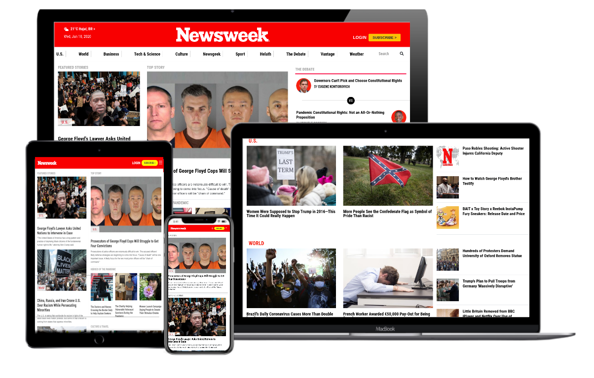

# Newsweek Clone

> This project requires me to build a replica of the news site Newsweek.com using the Bootstrap framework.

Additional description about the project and its features.

## Built With

- HTML
- CSS,
- Bootstrap

## Live Demo

[Live Demo Link](https://raw.githack.com/wrakc/newsweek-clone/feature/index.html)

## Author

👤 **Carlos Veiga**

- Github: [@githubhandle](https://github.com/carlosveigadev)
- Twitter: [@twitterhandle](https://twitter.com/carlosveigadev)
- Linkedin: [linkedin](https://linkedin.com/carlosveigadev)

## 🤝 Contributing

Contributions, issues and feature requests are welcome!

Feel free to check the [issues page](issues/).

## Show your support

Give a ⭐️ if you like this project!

## Acknowledgments

- Thanks the minskins,
- and Microverse for the opportunity.

## 📝 License

This project is [MIT](lic.url) licensed.
